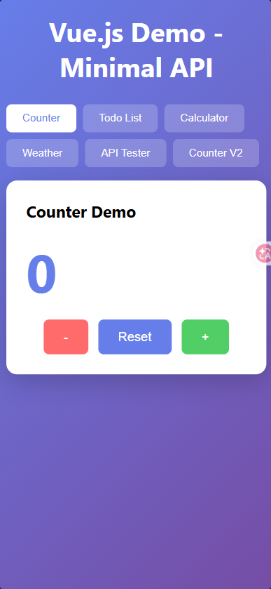

# MinimalAPI.NET8 升級 .NET 10
Minimal API .NET 10 + Vue.js 的測試專案



# 建立 Minimal API 專案

- 選擇【空的 ASP.NET Core】專案
- 打開 Program.cs 可以見到 Minimal API 的預設寫法
```
var builder = WebApplication.CreateBuilder(args);
var app = builder.Build();

app.MapGet("/", () => "Hello World!");

app.Run();
```
# 啟動
```bash
dotnet run --project MinimalAPI
```

http://localhost:8080

## Vue.js Demo
造訪首頁 http://localhost:8080 可看到 Vue.js 互動範例：

### 功能列表
- **Counter** - 簡單計數器
- **Todo List** - 待辦事項清單
- **Calculator** - 計算機
- **Weather** - 天氣展示（隨機）
- **API Tester** - REST API 測試工具
- **Counter V2** - 進階計數器（可調整遞增值）

## Swagger
- Swagger UI: http://localhost:8080/swagger
- Swagger JSON: http://localhost:8080/swagger/v1/swagger.json

只有在使用 Swagger 時，建議在 Development 模式下執行：
```bash
dotnet run --environment Development
```

## 單元測試

### 執行測試
```bash
dotnet test
```

### 執行測試並產生涵蓋率報告
```bash
dotnet test --collect:"XPlat Code Coverage"
```

涵蓋率結果會顯示在測試輸出的 summary 中。

### 測試專案結構
```
MinimalAPI.Tests/
└── WeatherServiceTests.cs    # WeatherService 單元測試
```

### 涵蓋率
- **50%** (WeatherService 類別)

## 專案分析

### 技術棧
- **.NET 10.0**
- **ASP.NET Core Minimal API**
- **C#** (啟用 nullable 和 implicit usings)
- **Vue.js 3** (Composition API)
- **Swashbuckle** (Swagger/OpenAPI)

### 前端技術
- Vue 3 (CDN)
- CSS3 (Flexbox + Grid)
- REST API 整合

### 專案結構
```
MinimalAPI.NET8/
├── MinimalAPI/                  # 主專案目錄
│   ├── Program.cs              # 入口點 (Minimal API)
│   ├── MinimalAPI.csproj       # 專案檔
│   ├── appsettings.json        # 設定檔
│   ├── wwwroot/                # 靜態檔案
│   │   ├── index.html          # Vue.js 主頁面
│   │   ├── styles.css          # 樣式表
│   │   └── app.js              # Vue.js 應用程式
│   ├── Services/
│   │   └── WeatherService.cs   # 天氣服務
│   └── Properties/
│       └── launchSettings.json
├── MinimalAPI.Tests/           # 測試專案
│   └── WeatherServiceTests.cs  # 單元測試
├── README.md                    # 專案說明
└── images/                      # 圖片資源
```

### 目前程式碼
- `Program.cs` 使用 `UseFileServer()` 提供靜態檔案服務
- 原本的 `MapGet("/", () => "Hello World!")` 已被註解
- 預設運行於 `http://localhost:8080`

### 用途
這是一個學習性質的專案，用於測試和理解：
- .NET 10 Minimal API 的基本用法
- Vue.js 3 前端整合
- 單元測試與涵蓋率
- Swagger/OpenAPI 文件

## 開發指令

| 指令 | 說明 |
|------|------|
| `dotnet run --project MinimalAPI` | 啟動 API 伺服器 |
| `dotnet test` | 執行單元測試 |
| `dotnet test --collect:"XPlat Code Coverage"` | 測試並產生涵蓋率 |

